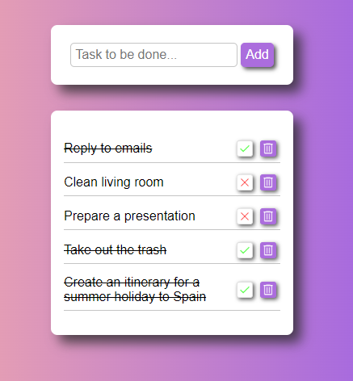

# To Do App With Local Storage

A To-Do list is a simple yet effective tool for organizing tasks and keeping track of what needs to be done.

A list that is saved to local storage is a useful tool for keeping track of tasks even when you're not online. This type of list allows you to add tasks, mark them as completed by checking a box, and delete tasks once they have been completed or are no longer needed.

---

